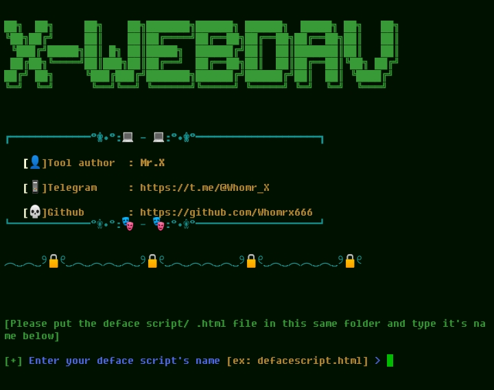

# X-webdav


## introduction
This is a simple tool to automatically deface vulnerable websites

## Instalations
```
$ apt update -y && apt upgrade -y
$ pkg install git -y
$ pkg install python -y
$ pip2 install requests
$ git clone https://github.com/Whomrx666/X-webdav.git
$ cd X-webdav
$ pip install -r requirements.txt
$ git pull
$ python X-webdav.py
```
# Single installation command
_______________________________________

    apt update -y && apt upgrade -y && pkg install git -y && pkg install python -y && pip2 install requests && git clone https://github.com/Whomrx666/X-webdav.git && cd X-webdav && pip install -r requirements.txt && git pull && python X-webdav.py

## Note
⚠️Only defaces websites with WebDAV vulnerability(Accepts unauthenticated PUT requests)⚠️

## Warning
First move your deface script into the tool before running the tool

## Instructions
- **First**: Install tools according to the instructions above
- **Second**: Move your own script into the tool
- **Third**: Go into tools then type the name of your HTML script into tools,for example hacker.html
- **Fourth**: Then the tool will automatically deface the target virtual website in target.txt
- **Last**: Then copy the link that has been successfully defaced into the browser to see the results

# What the code does
The code is a simple program in Python that attempts to upload a provided HTML file to multiple websites as specified in a target file named "targets.txt". The uploaded HTML file is intended to replace the content of the index page on the target websites. The program uses the "requests" library to handle the HTTP requests. The user is asked to input the name or path of the HTML file to be uploaded. If the file is found, the program then reads the contents of the file and the "targets.txt" file, which contains a list of target websites. The program then loops through each website in the list and attempts to upload the HTML file using a HTTP PUT request. If the upload is successful, a message is displayed indicating that the upload was successful. If the upload fails, a message is displayed indicating that the upload failed.

## Observation
This is a tool for education only, I am not responsible for any misuse
### Original Author
<a href="https://github.com/Whomrx666"></a>

### <<< If you copy , Then Give me The Credits >>>

## CONNECT WITH ME :

[](https://whomrxhackers.blogspot.com/)
[](https://twitter.com/whomrx666)
[](https://youtube.com/@whomrx666)
[](https://facebook.com/https://www.facebook.com/whomrx.666)
[](https://t.me/@Whomr_X)
[](https://wa.me/6287855190571)
[](https://www.tiktok.com/@whomr.x)

**If you want to donate, click on the button**
<a href="https://saweria.co/whomrx"></a>

### Visitors :


Happy deface